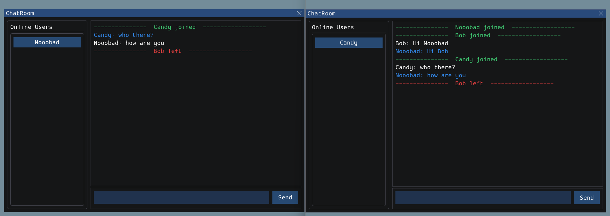
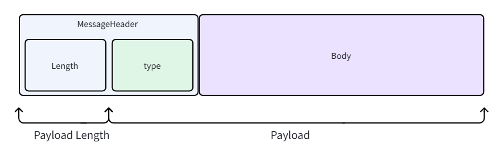
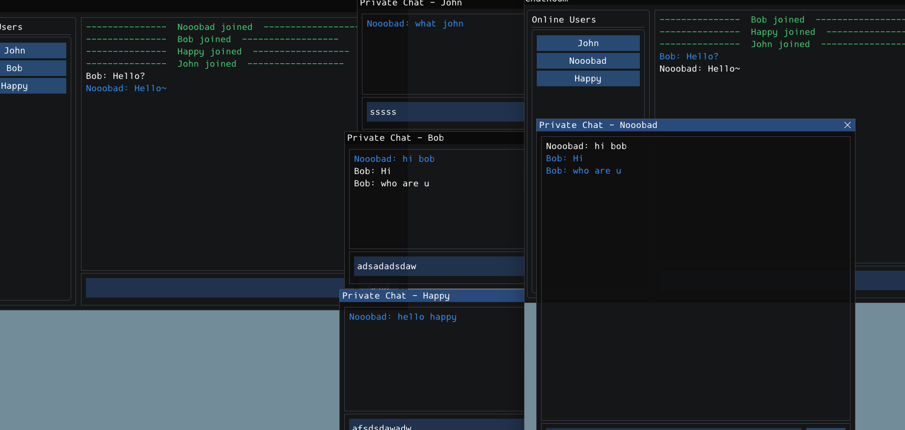

# C++ TCP Chat Room

A Windows client/server chat application with a custom framed TCP protocol, asynchronous session/event processing, and a Dear ImGui interface. The project demonstrates the path from socket bytes to typed messages and visible client state.

*Multi-client group chat and presence updates, captured in the coursework report.*

## Features

- Designed typed messages for connection greeting, welcome, group chat, private chat, user join/leave, and system notifications.
- Implemented buffered TCP framing so incomplete messages can wait for more bytes and multiple complete messages can be dispatched from one receive buffer.
- Separated shared transport/session code from server routing and client presentation.
- Organized connection acceptance, session I/O, and event processing through threads and synchronized queues.
- Built a user list, group conversation, private conversation windows, and FMOD notification playback.

The UI rendering bootstrap uses the Dear ImGui Win32/DirectX 12 example. FMOD supplies audio playback; these integrations are distinct from the application's protocol and chat logic.

## Protocol and UI

*A four-byte length field precedes a two-byte message type and serialized body. See `Common/Model.h` for the actual encoding and parser.*

*Private conversations alongside the group room.*

## Build and run locally

1. Install the MSVC v143 C++ toolset and Windows SDK on Windows. Open `WM9M4-ChatRoom.sln`; use **Release | x64** (C++20).
2. In `ChatRoom-Client` project properties, replace the old absolute FMOD include/library paths with `$(ProjectDir)ThirdParty\FMOD\inc` and `$(ProjectDir)ThirdParty\FMOD\lib`. Preserve the shared `$(SolutionDir)Common` include path.
3. Make the matching FMOD runtime DLLs available beside the client executable. The project links `fmod_vc.lib` and `fmodstudio_vc.lib`.
4. Build both projects. Start `ChatRoom-Server` first, then launch two or more `ChatRoom-Client` instances and enter display names.
5. Test group messages, open a user's private conversation, and disconnect a client to observe presence changes.

The server listens on **TCP port 65432**; the client currently connects to **127.0.0.1:65432**. Both settings are in the respective `main.cpp` files. The client's working directory should be `ChatRoom-Client/` so `audio/Alert.wav` and `audio/Join.mp3` resolve. Press Enter in the server console to stop it.

## Code guide

| Location | Responsibility |
| --- | --- |
| [`Common/Model.h`](Common/Model.h) | Message types, serialization, and TCP buffering |
| [`Common/BaseSession.h`](Common/BaseSession.h) | Shared send/receive dispatch |
| [`Common/ThreadSafeQueue.h`](Common/ThreadSafeQueue.h) | Cross-thread event queues |
| [`ChatRoom-Server/Server.h`](ChatRoom-Server/Server.h) | Server lifecycle and routing |
| [`ChatRoom-Client/Client.h`](ChatRoom-Client/Client.h) | Client connection and event handling |
| [`ChatRoom-Client/ClientUI.cpp`](ChatRoom-Client/ClientUI.cpp) | Login and chat views |

## Scope

This is a coursework networking prototype, not a production messaging service. In particular, `BaseSession::sendMessage` currently calls `send` once and does not retry partial writes; that should be addressed before treating transport delivery as robust under load. Display names are not an authentication mechanism.

The [combined coursework report](WM9M4.pdf), Section 2, explains the chat system; Section 1 covers a separate rasterizer. All README images are original figures extracted from that report.
